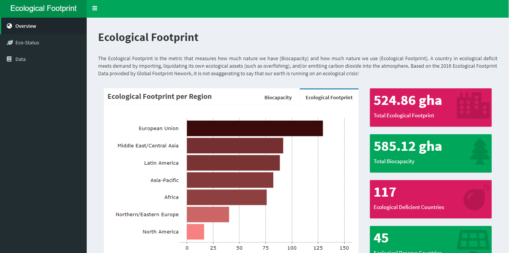
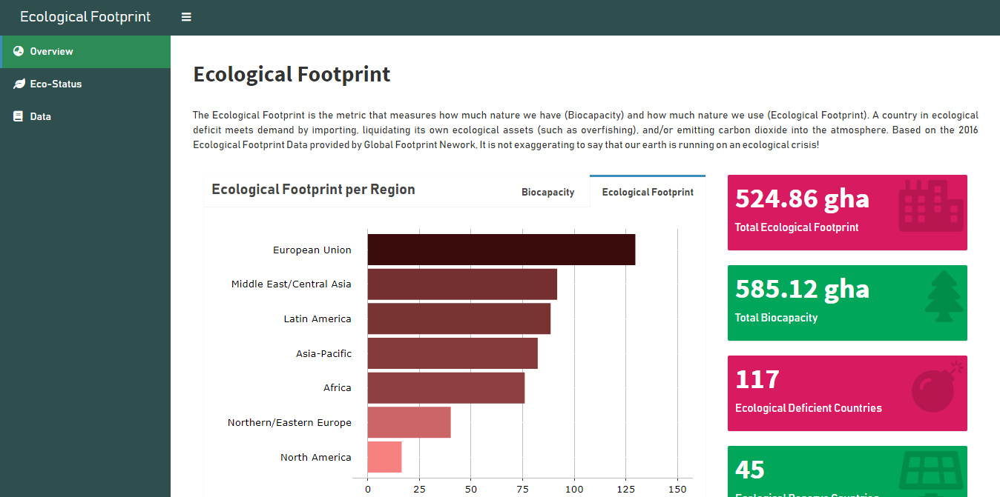

# Eco-Status
 
Visualizing ecological footprint and biocapacity from countries based on Global Footprint Network 2016 data using Shiny.

link: https://nabiilahardini.shinyapps.io/Eco-Status/

# Features

* Neat code for `header-sidebar-body` structure
* Paragraph inside the body
* Boxes: 
  + tabBox
  + valueBox
* Neat fluidPage layouting
* Skins

Dynamic Content:

* selectInput
* Interactive plot (plotly) output
* Leaflet output
* Data table output

# Styling

Default theme using dasboard skins = "green"

Customize shinydashboard theme with CSS: 

For further reference, you can go to [`dashboardthemes`](https://github.com/nik01010/dashboardthemes) package for customizing shinydashboard theme without knowing many about CSS.